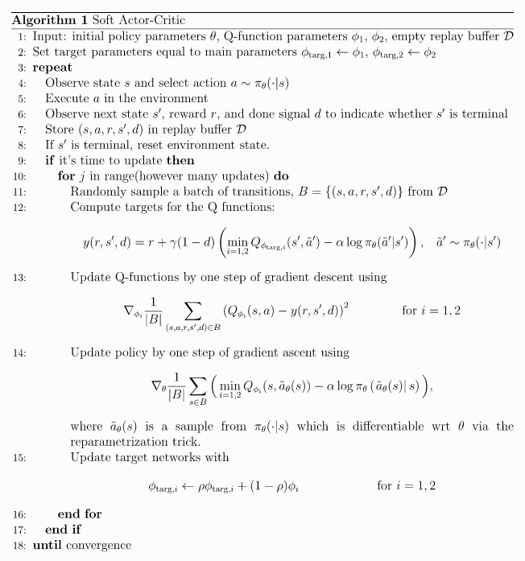

# My SAC implementation

## The Algorithm

### Pseudocode





## `LunarLanderContinuous-v2` parameters:
```
No good implementation
```

Algorithm's net:
```

```

## `BipedalWalker-v3` parameters:
```
No good implementation
```

Algorithm's net:
```

```

## Credits:

- [SAC | OpenAI](https://spinningup.openai.com/en/latest/algorithms/sac.html#pseudocode)
- [Environments in OpenAI](https://gym.openai.com/envs/#box2d)
- [Deep-Reinforcement-Learning-Hands-On-Second-Edition](https://github.com/PacktPublishing/Deep-Reinforcement-Learning-Hands-On-Second-Edition/tree/master/Chapter17)
- [Policy Gradient Algorithms | Lilian Weng's Blog](https://lilianweng.github.io/lil-log/2018/04/08/policy-gradient-algorithms.html)
- [DATASETS & DATALOADERS | PyTorch](https://pytorch.org/tutorials/beginner/basics/data_tutorial.html)
- [SAVING AND LOADING MODELS | PyTorch](https://pytorch.org/tutorials/beginner/saving_loading_models.html)
- [PROBABILITY DISTRIBUTIONS - TORCH.DISTRIBUTIONS | PyTorch](https://pytorch.org/docs/stable/distributions.html)
- [SOURCE CODE FOR TORCH.DISTRIBUTIONS.NORMAL | PyTorch](https://pytorch.org/docs/stable/_modules/torch/distributions/normal.html)
- [SOFTPLUS | PyTorch](https://pytorch.org/docs/stable/generated/torch.nn.Softplus.html#torch.nn.Softplus)
- [AUTOGRAD MECHANICS | PyTorch](https://pytorch.org/docs/stable/notes/autograd.html#locally-disable-grad-doc)
- [Reparameterization Trick](https://stats.stackexchange.com/a/226136)
- [SAC implementation | TDS](https://towardsdatascience.com/soft-actor-critic-demystified-b8427df61665), [(code)](https://github.com/vaishak2future/sac/blob/master/sac.ipynb)
- [Probability density function | Wikipedia](https://en.wikipedia.org/wiki/Probability_density_function)
- [Change of variables: Apply tanh to the Gaussian samples | math.stackexchange.com](https://math.stackexchange.com/a/3283855)


